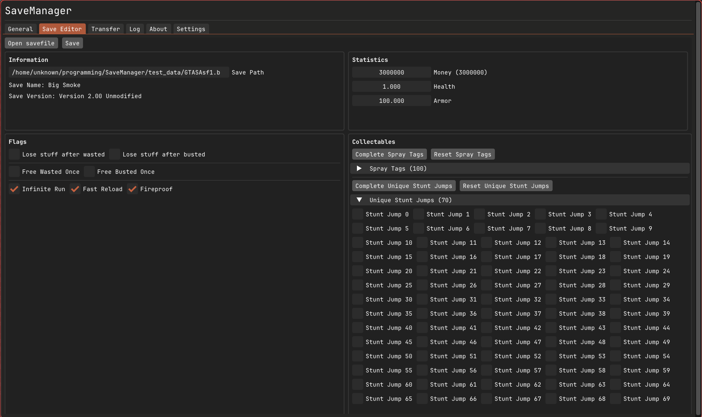

# Changelog

## [1.7.0] - 2026-05-??
*Core logic moved into a separate library linked by the GUI*
 
### Core
#### Added
- Conflict-safe restores: newer saves preserved and resolvable via the Resolve Conflicts dialog
- Undo last restore
- Each backup ZIP now includes a manifest with SHA-256 checksums and original timestamps
- Extension blocklist expanded

#### Fixed
- Loaded plugin count
- Mass backup waits until refreshes are complete
- Backups not visible after uninstalling a game
- Restored savegames now use their original save timestamps
- Backup all not renaming from `.tmp` extension on completion
- Prefix scan aborting on first filesystem error
- Animated background defaulting to enabled; Y position not saved correctly
- MultiMC scanner running on non-Linux platforms
- Official Minecraft launcher using wrong path on Windows

#### Changed
- Lua `print` redirected to the log file / log tab

### GUI
#### Added
- Resolve Conflicts button to keep or delete conflicts (existing save is newer than save being restored)
- Build date & commit hash to about tab

#### Fixed
- Incorrect SFTP backup selection naming
- Light mode

#### Performance
- Backup labels no longer reloaded from disk every frame, cached on refresh
- Search query no longer lowercased every frame, only on input change

#### Changed
- Settings split into Appearance, Launcher Support, and Blacklisted Games panels
- Paths section removed from settings
- Dashboard item spacing tightened

### Known Issues / Limitations
- Original Anno editions not supported due to install path limitations (a plugin can be written for this)
- Grouping issues with unknown / partially supported games (improved since #2)

---

## [1.6.0] - 2026-05-08
Plugins can be found [here](https://github.com/msh31/savemanager-plugins)

### Added
- (Experimental) Custom detector support through LUA plugins (see [docs](docs/SCRIPTING.md))
- Minecraft (Java) support (Official / Modrinth / Curseforge / Prismlauncher, MultiMC(Linux only))
- Animated background (off by default)
- Keyboard shortcuts (Ctrl+R for refresh, Ctrl+F for search, Close modals on ESC)
- Window size & position persistence
- Atomic backup writing (Prevents corrupted backups if there is a crash or power loss during backup)

### Fixed
- A crash when you delete a savefile outside of the application
- Backup tab not being scrollable 

### Changed
- Creating a single backup of a save or a backup of all is now done asynchronously (Minecraft saves can be big)

### Removed
- Duplicate backup tab (It's under dashboard and no longer standalone)

### Known Issues / Limitations
- Original Anno editions not supported due to install path limitations (You can make a plugin for this though, specific to your install)
- Grouping issues with unknown / partially supported games (Similar to #2 but has since improved)

### Development related
- All code relating to textures has been removed
- Steam library path logic moved to backend/utils/steam/steam.cpp

## [1.5.4] - 2026-04-29
### Fixed 
- Dashboard lag caused by filesystem scans and JSON reads every frame

## [1.5.3] - 2026-04-29
### Fixed 
- Backup tab scanning logic causing performance issues 

## [1.5.2] - 2026-04-28
### Fixed 
- Possible invalid directory name crash upon startup

## [1.5.1] - 2026-04-27
### Added
- Backup tab in dashboard to view and manage all backups created
- Backup All button on save cards (If you want to backup everything at once per-game)

## [1.5.0] - 2026-04-23
## The big one - Save editor (albeit a basic one)

### Added
- Basic Save Editor (exclusive to GTA San Andreas)
- MacOS support (Apple Silicon)
- Sort (A-Z / Date) and filter by platform in dashboard toolbar
- Search bar in dashboard
- Config directory is now editable properly through a cli flag ``--config-dir "path"``

### Fixed 
- Rare issue of Rockstar Games saves not detecting on Windows 
- Anno save detection on Linux
- Anno 1800/117 save path now correctly points to profile data
- Data races in detection and transfer views
- libcurl write callback corruption bug
- zip archive null handle UB and resource leaks
- Version comparison was lexicographic, now numeric
- Various SFTP handle leaks
- JSON parsing now handled gracefully
- Settings path section layout

### Removed
- Custom game support through the json (Temporarily, it needs improvement)

### Changes
- Redesigned dashboard UI (was general tab)
- Logger moved to in-memory deque, no more disk polling from UI
- Improved detection error handling
- Async detection on startup, cards pop in progressively not blocking the UI
> [!NOTE]
> On Windows the config directory has changed from ``AppData\Roaming\SaveManager`` to ``C:\Users\username\savemanager``

### Development related
- Use Conan for external dependencies (besides stuff that isn't on there)
- Move codebase to C++23 progressively
- General code improvements for better maintainability

### Known Issues / Limitations
- Original Anno editions not supported due to install path limitations (You can add them manually though!)
- Grouping issues with unknown / partially supported games (Similar to #2 but has since improved)

## [1.4.1] - 2026-04-04
### Fixed
- Unreal cover art / showing up as N/A on Linux

## [1.4.0] - 2026-04-04
### New verified supported games
- Mafia The Old Country
- Clair Obscur: Expedition 33
- Metal Gear Solid Delta: Snake Eater
- Nobody Wants To Die
- High on Life
- SpongeBob SquarePants: Titans of the Tide
- Assassin's Creed Mirage 
- Assassin's Creed Shadows 

### Added
- Unreal support on Windows
- Mass Backup button 
- Refresh cache button 
- Backup labels
- Dark / Light Mode toggle
- Copy log to clipboard
- Automatic log cleanup (If above 100 lines)

### Fixed
- Duplicate cards for games with N/A appid [#7](https://github.com/msh31/SaveManager/issues/7)
- Incorrect Game name (shown by steam appid or N/A) on some games that are not yet supported (Backups will not work properly since the names are similar if N/A) [#2](https://github.com/msh31/SaveManager/issues/2)
- A crash caused by attempting to load corrupted translation files.

### Changes
- An Internet connection is no longer required by default 
- Codebase changes in the entrypoint
- Overall UI improvements for better User Experience
- Improved overall detection accuracy
- Use %USERPROFILE% (C:\Users\username) as home dir instead of appdata for Windows
- Codebase changes in the entrypoint and other areas

### Known Issues / Limitations
- Original Anno editions not supported due to install path limitations (You can add them manually though!)
- Grouping issues with unknown / partially supported games (Similar to #2 but has since improved)

## [1.3.0] - 2026-03-26
### New Game support
- The original GTA Trilogy 
- Anno franchise
- Manhunt 1 & 2
- Max Payne 1 & 2
- God of War 2018 & Ragnarok
- Crimson Desert (Beta, through custom games)

### Added
- Check for updates button
- Game blacklist (User configurable)
- Custom Game list (User configurable)
> Note: both the blacklist and custom list do also get downloaded from github
    The custom game list is there for non specific game launcher / publisher games
    and it will receive more updates, hopefully with community additions

### Fixed 
- Game Images aren't updated on refresh [#4](https://github.com/msh31/SaveManager/issues/4)
- Downloading of game images is not done asynchronously [#5](https://github.com/msh31/SaveManager/issues/5) (semi-fixed)

### Changes 
- Improved support for Unreal Games
- Texture loading is now done asynchronously
- Logger is now thread-safe
- No more direct system calls to open a path

### Known Issues / Limitations 
- Duplicate cards for games with N/A appid [#7](https://github.com/msh31/SaveManager/issues/7)
- Incorrect Game name (shown by steam appid or N/A) on some games that are not yet supported (Backups will not work properly since the names are similar if N/A) [#2](https://github.com/msh31/SaveManager/issues/2)

- Original Anno editions not supported due to install path limitations (You can add them manually though!)

## [1.2.1] - 2026-03-21
### Fixed
- Password authentication being the only option for SFTP transfers
- A path joining bug in the SFTP implementation
- Incorrect path passed to the upload and download buttons for SFTP transfers
- Connect button not being hidden when connected
- Out of bounds error in the transfer tab

## [1.2.0] - 2026-03-21
### Added
- Remote sync over SFTP, to and from a server (With progress indicators & support for multi file transfers)
- Remove backup functionality
- Refresh saves button
- Open Path button (Opens the path to the detected savegame's location)

### Fixed 
- Silent JSON translation failure errors on startup [#3](https://github.com/msh31/SaveManager/issues/3)
- About tab showing outdated info from 1.0.0
- Memory leak caused by not deleting the in-memory textures on shutdown
- Curl url type causing segfaults under certain conditions

### Changes 
- Button presses now have some visual feedback
- General code refactoring in: ZipArchive, Detection & individual tabs

### Known Issues / Limitations
- Incorrect Game name (shown by steam appid or N/A) on some games that are not yet fully supported (Backups will not work properly since the names are similar if N/A) [#2](https://github.com/msh31/SaveManager/issues/2)
- Game Images aren't updated on refresh [#4](https://github.com/msh31/SaveManager/issues/4)
- Downloading of game images is not done asynchronously [#5](https://github.com/msh31/SaveManager/issues/5)

## [1.1.1] - 2026-03-14
### Fixed
- Unreal toggle not being wired up correctly

## [1.1.0] - 2026-03-14
### Added
- Heroic Games Launcher support (Ubisoft, Rockstar, Epic/Unreal)
- Unreal Engine game detection via .sav files (Linux Only)
- Update Translations button in settings

### Fixed
- getenv null check in paths
- zip_fread error handling
- temporary logger() instance in network.cpp

### Changes
- User Interface is more dynamic and polished to handle weird scenarios.
- Translations refactor (single init, O(1) lookups)

### Known Issues
- Incorrect Game name (shown by steam appid or N/A) on some games that are not yet supported (Backups will not work properly since the names are similar if N/A) (#2)

## [1.0.0] - 2026-03-10
### Added
- Steam/Proton save detection
- Lutris save detection  
- Ubisoft Connect support (Linux + Windows)
- Rockstar Games Launcher support (Linux + Windows)
- Save backup and restore
- Game cover art via Steam CDN
- Settings tab with configurable paths
