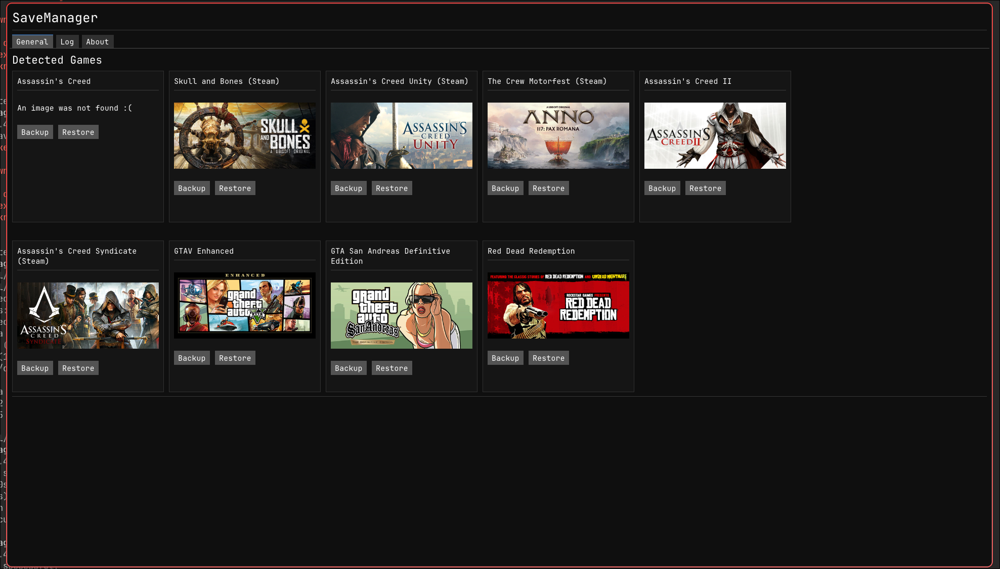

# SaveManager
### The swiss army knife of save management

[Download](#download) • [Features](#features) • [Contributing](CONTRIBUTING.md) • [License](#license)

---

SaveManager is a local save manager for PC games. It handles backup and restore for Ubisoft and Rockstar saves across Windows and Linux.

## Download

Available for Windows and Linux (x86-64) on the [releases page](https://github.com/msh31/SaveManager/releases).

## Features

- **Backup & Restore** — create and restore save backups
- **Automatic Detection** — finds Ubisoft and Rockstar saves on Windows; Steam/Proton, Wine, and Lutris on Linux
- **Configurable** — custom backup paths, per-store toggles, and platform-specific settings
- **Cross-platform** — Windows and Linux (x86-64)

### Planned

- **Save Editor** — read and edit save data, starting with Rockstar titles
- **PSP ↔ PPSSPP** — convert and transfer saves between physical PSP and emulator
- **Web Sync** — sync and share saves via an upcoming web platform

## Supported Stores

| Store | Windows | Linux |
|-------|---------|-------|
| Ubisoft | Yes | Yes (Steam/Proton, Wine, Lutris) |
| Rockstar | Yes | Yes (Steam/Proton, Lutris) |

---

## Contributing

See [CONTRIBUTING.md](CONTRIBUTING.md) for build instructions and contribution guidelines.

## License

GPLv3 — see [LICENSE](LICENSE.md).
